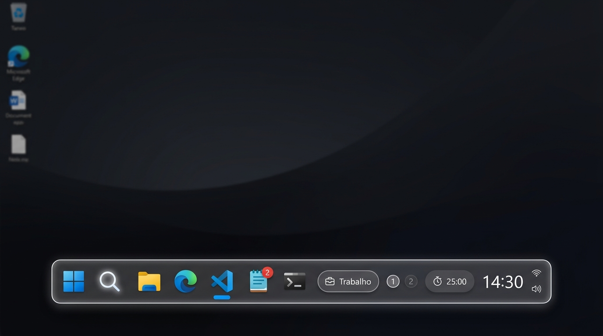

# GigaDock — Dock Windows

Aplicativo desktop para Windows 10/11, feito em C#, .NET 10 e WPF, com barra flutuante, ambientes Trabalho, Estudos e Pessoal, atalhos, coleções e widgets. Interface em português do Brasil e configurações locais, sem backend próprio ou fluxo de conta na dock.

**Revisão de widgets em 06/10/2026:** build Release aprovado, zero erros e um aviso existente nos testes. Resultado da suíte final: **140 aprovados, zero falhas**. Foram excluídos os dois testes `SystemIntegration` que alteram autostart/barra de tarefas. Veja a [refatoração e inventário](docs/REFATORACAO-WIDGETS.md) e o [histórico](docs/STATUS.md). Players, notificações reais, suspensão física, instalação e DPI ainda precisam de validação manual.

O instalador foi corrigido para não ativar automaticamente o modo de barra principal. Uma preferência antiga explicitamente habilitada pode continuar ativa na atualização. O instalador local foi reempacotado em 06/10/2026 com a refatoração dos widgets, sincronização da lixeira com o desktop e controles de mídia com escala proporcional à dock.



*A imagem acima é uma prévia anterior; não representa uma captura validada de todos os estilos atuais.*

## Atualizações implementadas

- **Isolamento de ambientes:** itens locais permanecem no ambiente; aplicativos globais explicitamente configurados aparecem em todos. Preferências antigas passam pela migração registrada, sem apagar novos globais em cada salvamento.
- **Loja de widgets com estilos:** escolha a aparência antes de adicionar ou use **Mudar estilo** nos instalados. As galerias mostram referências ilustrativas antes da aplicação.
- **Widgets por ambiente:** estilo e visibilidade salvos separadamente. Editar um ambiente inativo não deve alterar a dock atual; a configuração aparece ao trocar de ambiente. Há testes específicos desse isolamento.
- **Personalizar direto na dock:** botão direito ou Shift+F10 nos widgets de relógio, clima, mídia, calendário, monitor e bateria. Nos controles rápidos, abre o painel de configuração.
- **Mídia com cores da música:** cartão com capa, título mais espaçoso e progresso real; fundo, borda e destaque derivados da capa. Inclui versões compacta, mini e barra, controles vetoriais padronizados e tamanho proporcional à altura da dock, sem escala duplicada. A reprodução vem da sessão de mídia publicada pelo Windows.
- **Clima:** nove estilos, dados atuais, previsão diária e próximas horas, vento, precipitação observada e nascer/pôr do sol. Dados ausentes mostram traços.
- **Relógio:** hora/data em duas linhas, outras variantes digitais, mostradores analógicos, três relógios mundiais, cronômetro e temporizador de cinco minutos.
- **Reuniões:** próximo compromisso futuro, horário, contagem e abertura explícita de link HTTPS; editor local de título, data e link.
- **Monitor:** CPU, RAM, rede e armazenamento, com indicadores, anéis e gráficos. Serviço separado para leitura das métricas; corrigido o cálculo de RAM física.
- **Bateria e lixeira opcionais:** bateria compacta ou em anel, com estado de carga/carregamento; lixeira abre a do Windows. Ao ativar a lixeira nos ajustes, seu ícone é ocultado na área de trabalho; ao desativar, volta ao desktop. Essa escolha é global e só altera o Windows por ação explícita. A bateria tem escolha por ambiente. Veja [comportamento e limites da lixeira](docs/LIXEIRA-DESKTOP.md).
- **Controles rápidos:** seleção dos atalhos visíveis, contador e referências dos visuais compacto/em anéis, salvos por ambiente.
- **Ajustes → Visualizações:** referências e opções para miniaturas de janelas, clima detalhado, relógio analógico e prévia de pastas. As opções de clima/relógio agora editam o widget do ambiente ativo; miniaturas de janelas e pastas continuam preferências globais.
- **Miniaturas de janelas:** DWM, navegação entre páginas, ativação e fechamento explícitos. Mostram janelas do aplicativo, não suas abas internas.
- **Pastas e arquivos:** lista local com prévias limitadas de imagens/texto ou metadados; abrir um arquivo exige ação explícita.
- **Ajustes e aparência:** temas, cores, dimensões, transparência, cantos, espaçadores, ocultação automática, coleções e organização da dock. Parte dessa aparência ainda é global.

## Aparência e interação: novidades recentes

| Recurso | Como funciona | Escopo / limites |
| --- | --- | --- |
| Painéis por clique ou mouse | Em **Ajustes → Visualizações**, escolha **Ao clicar** ou **Ao passar o mouse**. Clima e prévias habilitadas de janelas/pastas abrem acima da dock; mouse espera 350 ms e permite atravessar até o painel. Enter/Espaço continuam disponíveis. | Modo salvo por ambiente ativo; configurações antigas usam clique. Prévias de janelas/pastas continuam habilitadas globalmente. |
| Ícone próprio | Ícone embutido no aplicativo/instalador e aplicado às janelas principais e à bandeja. Atalhos usam o executável, índice 0. | [ICO com 8 resoluções, 16–256 px](assets/gigadock.ico), [prévia PNG](assets/gigadock.png). Extração dos ícones dos executáveis foi conferida; cache do Explorer e instalação não validados manualmente. |
| Mídia com cores da capa | Cor extraída de miniatura de 32 × 32 pixels, agrupando tons semelhantes; texto claro sobre degradê escuro. Sem capa utilizável, fundo neutro. A barra representa progresso real. | Cálculo nas atualizações de metadados. Revisão da consulta evita sobrepor dados de uma consulta mais recente. Não analisa batidas/áudio. Cache de arquivos temporários ainda precisa de limpeza. |
| Modo gamer RGB | Botão **RGB** na dock, opção nos ajustes e no menu da bandeja. Mantém o arco-íris em volta da dock sem depender de música, até desativar. | Global e salvo ao fechar. Desligar gamer retorna ao RGB Musical se habilitado; desligue ambos para apagar em todas as situações. Com animações desativadas, borda estática. |
| Expansão dos ícones | Aplicativo apontado cresce 1,45×; vizinhos imediatos, 1,16×. Transição de 140 ms a partir da base; retorno ao sair e resposta ao foco de teclado. | Na seção de aplicativos. Respeita Desativar animações e a preferência de animação do Windows; outros ícones/widgets conservam seus efeitos anteriores. Margem superior reserva espaço, sem aumentar a altura visual da barra. |

Essas mudanças estão no instalador local mais recente. Aparência, interação, troca rápida de música, reinício e múltiplos monitores ainda precisam de validação manual. A margem da magnificação aumenta a área transparente da janela; é necessário conferir ocultação automática e áreas de clique.

## Escolher e mudar o estilo de um widget

1. Abra **Ajustes → Widgets** e selecione o ambiente que deseja editar.
2. Abra a **Loja de widgets** e clique em **Escolher estilo** antes de adicionar.
3. Para um instalado, use **Mudar estilo** na loja ou **Escolher estilo** na lista de widgets.
4. Na dock, também é possível usar **botão direito → Personalizar…**.
5. Escolha a referência desejada. A alteração preserva a visibilidade do widget e pertence ao ambiente selecionado.

A loja atual permite um widget de cada tipo por ambiente. Escolher outro estilo troca o instalado; não cria uma segunda instância do mesmo tipo. Compromissos, localização do clima, usuário do GitHub e conteúdo das notas ainda usam dados globais existentes.

## Widgets: estado real

“Implementado” indica que existe lógica no código, não que todas as integrações, aparências e escalas foram verificadas na instalação real.

| Widget | Estilos / recursos | Limites atuais |
| --- | --- | --- |
| Relógio | Hora, segundos, hora/data, dígitos em cartões, data, dia do mês, hoje, mundial e analógicos minimalista/claro/escuro/com digital | Fusos fixos: São Paulo, Londres e Tóquio. Cartões sem animação de virada. |
| Cronômetro / temporizador | Opções do relógio; clique inicia/pausa e menu reinicia | Temporizador fixo de 5 min com prazo absoluto e evento único de conclusão, inclusive oculto. Sem alarme dedicado ou persistência da contagem após encerrar. |
| Pomodoro | Foco, pausas, ciclos, iniciar/pausar/reiniciar/avançar; som de transição | Configuração por ambiente; funcionamento instalado e passagem de fases ainda precisam de conferência manual. |
| Calendário / reuniões | Agenda, próximo evento/reunião e link HTTPS | Eventos locais e iCalendar com UTC/TZID, floating, recorrências, exceções e dia inteiro. Horizonte de 30 dias e limites de importação. Sem login Outlook/Google ou controle de câmera/microfone. |
| Mídia | Capa e controles, Tocando agora, Mini e Barra | Depende da sessão de mídia do Windows. Sem arrastar a barra para mudar a posição; sem mídia publicada, o widget fica oculto. |
| Clima | Temperatura, local/detalhes, previsão diária, hoje/previsão, condição, próximas horas, vento, sol e cartão azul | Usa internet via wttr.in; três dias e até cinco amostras futuras, nos intervalos recebidos. Indicador solar usa o horário da observação. |
| Monitor do sistema | CPU/RAM, anéis, gráficos, rede e disco | Coleta compartilhada a cada 2 s somente visível e para métricas solicitadas; 30 amostras. Primeira amostra e indisponibilidade separadas de zero. VPN pode duplicar tráfego; GPU não implementada. |
| Bateria | Porcentagem/ícone ou anel | Leitura a cada 30 s somente visível. Diferencia carregando, descarregando, completa, sem bateria, desconhecida e leitura indisponível. |
| WhatsApp | Notificações locais e heurísticas de chamadas | Depende de permissões, notificações do Windows e títulos de janela. Não lê todas as conversas nem garante contagem completa de mensagens. |
| Teams | Notificações locais, processo aberto e heurísticas de reunião/chamada | Não lê presença oficial Disponível/Ocupado/Ausente. Nomes de salas e chamadas são inferidos, não garantidos por API do Teams. |
| GitHub | HTML público de contribuições e animações | Cache de 30 min, falha explícita e dados anteriores preservados. Depende do HTML; não é Actions/PRs. Total não confirmado mostra dias com atividade. |
| Discord | Atalho para abrir o aplicativo | Voz indisponível: não há RPC autenticado. Sem pipe inútil, sala fictícia ou confirmação de participantes. |
| OBS | Atalho para abrir o aplicativo | Gravação indisponível sem integração WebSocket; o botão não confirma sucesso local. |
| Notas | Editor integrado e autosave local | Loja e editor disponíveis; contador/texto reais, salvamento por arquivo temporário e erro explícito. Texto compartilhado entre ambientes. |
| Cotação de moedas | Tipo definido no modelo | Sem widget funcional implementado no catálogo atual. |

## Controles rápidos e prévias

- **Wi-Fi, Bluetooth, modo escuro e foco:** abrem páginas de configurações do Windows. Não são interruptores diretos desses estados; escolher visibilidade/estilo não modifica o sistema.
- **Bloquear teclado:** bloqueio temporário de 30 segundos, liberado por F12, clique, troca de ambiente ou encerramento. Não substitui o bloqueio da sessão nem cobre a área de segurança do Windows.
- **Bloquear tela e suspender:** ações nativas; suspender pede confirmação local. As ações não foram testadas manualmente nesta revisão.
- **Janelas:** miniaturas dependem de disponibilidade do DWM e da janela de origem; conteúdo protegido ou minimizado pode não estar disponível. Houve teste de registro de miniatura com janelas próprias, não uma validação geral de aplicativos de terceiros.
- **Pastas:** até 100 itens; imagens de até 20 MB; texto de até 1 MB com leitura de até 4.000 caracteres. PDF e outros formatos mostram metadados, sem renderização interna.

## Consumo de recursos e widgets ocultos

Os 13 widgets implementados agora participam de um gerenciador de atividade compartilhado. Ele distingue habilitação, renderização, ambiente ativo e visibilidade real da dock, incluindo auto-hide por deslocamento, minimização e fullscreen. O gerenciador não cria polling próprio. A [auditoria de performance e lifecycle](docs/AUDITORIA-ATIVIDADE.md) inclui inventário completo, soluções e limites.

| Componente | Enquanto visível | Quando oculto/inativo |
| --- | --- | --- |
| Monitor CPU/RAM/rede/disco | Coletor único a cada 2 s, até 30 amostras | Para e libera contador CPU; retoma com leitura imediata |
| Bateria | Leitura a cada 30 s | Para; retoma com leitura imediata |
| Mídia | Progresso 1 s apenas reproduzindo; metadados por eventos | Sem timeline/decode de capa; eventos mínimos só quando necessários ao RGB musical |
| Relógio | Segundo, minuto ou virada do dia conforme estilo | Sem redraw; temporizador iniciado mantém um despertar para conclusão |
| Pomodoro | Atualização visual 1 s quando iniciado | Prazo absoluto e despertar de conclusão preservam alarme; parado não tem timer |
| Calendário / clima / GitHub | Atualização por necessidade; cache ICS 15 min, clima 1 h, GitHub 30 min | Para polling/animações e cancela consultas dispensáveis |
| Teams / Discord | Títulos/processos estimados / integração de voz indisponível | Polling Teams para; Discord não faz conexão de demonstração |
| Notas / WhatsApp / OBS | Debounce de salvamento / eventos compartilhados / estado visual | Preserva notas pendentes e notificações necessárias; sem novo polling |
| RGB, badges e expansão | Animações conforme preferência e visibilidade | Remove animações e popups, inclusive auto-hide; preferência gamer preservada |

Capas ficam em memória com tamanho limitado, sem criar novos arquivos temporários por atualização. Cache de ícones limitado a 512 entradas. Notificações Windows, detecção de fullscreen/ativação, liberação do teclado e tarefas explícitas continuam quando necessário.

A primeira seleção histórica teve 41 testes aprovados. A revisão atual amplia diagnóstico, suspensão, cache, timezone e integrações: veja os [resultados desta etapa](docs/widget-refactor-validation.json). Não há benchmark comparável de CPU/RAM da dock real que sustente promessa de aplicativo “ultraleve”.

## Dados locais e acesso à rede

- Configuração: `%LOCALAPPDATA%\DockWindows\settings.json`, com arquivo temporário, backup `.bak` e migrações.
- Notas: `%LOCALAPPDATA%\DockWindows\notas.txt`.
- Instalação padrão: `%LOCALAPPDATA%\Programs\DockWindows`.
- Não foi identificado backend próprio, telemetria ou fluxo de autenticação da dock na análise do código.
- **O aplicativo não é totalmente offline:** clima consulta wttr.in, GitHub consulta HTML público e calendário pode ler URL ICS. Abrir links também aciona outros aplicativos.
- Consultas dos widgets são condicionadas à atividade; notificações e serviços globais necessários têm lifecycle separado.
- URLs ICS são salvas nas configurações: ainda é necessário endurecer a validação e evitar URLs com credenciais ou tokens. Os novos links de reunião rejeitam usuário/senha na URL.

## O que falta

### Correções prioritárias

- [x] Instalador não ativa ocultação da barra nativa automaticamente; modo de barra principal exige escolha explícita.
- [x] Corrigir as falhas da suíte anterior: última suíte da refatoração com 140 testes aprovados; quatro testes adicionais da lixeira aprovados. Dois testes que alteram o Windows ficaram excluídos.
- [x] Versionamento dos projetos centralizado em `Directory.Build.props` (3.0.0).
- [ ] Corrigir migrações de schema: padrão `4`, carregamento antigo chegando a `6`, com migrações v5/v6 aninhadas na condição de v4.
- [x] Migração de aplicativos globais e isolamento de ambientes corrigidos e cobertos por testes.
- [ ] Revisar comandos que executam diretamente caminhos/protocolos e erros silenciosos; centralizar validação e mensagens úteis.
- [ ] Revisar validação/privacidade do ICS e validar em uso real o lifecycle, cancelamento e descarte implementados.
- [ ] Atualizar textos da loja, interface e scripts para corresponderem às funções reais; revisar textos com problemas de codificação.

### Recursos ainda não implementados / incompletos

- [ ] Mostrar rede Wi-Fi atual/sinal e dispositivos Bluetooth realmente conectados; hoje os controles apenas abrem configurações.
- [ ] Acesso aos aplicativos da bandeja conforme solicitado; o serviço atual gerencia somente o ícone da dock. Ícones da bandeja não representam todos os processos em segundo plano.
- [ ] Lembrete de água.
- [ ] Saída de áudio, volume por aplicativo e mutar microfone.
- [ ] Prévia da área de transferência.
- [ ] Captura de tela, capturas recentes, Downloads e arquivos recentes como widgets próprios.
- [ ] Estante de arquivos e compartilhamento de arquivos para Windows equivalente ao exemplo de AirDrop.
- [ ] Conexão real do Discord e controle real do OBS.
- [ ] Substituir a leitura HTML do GitHub por uma integração mais robusta; estados de erro e nome da loja já foram corrigidos.
- [ ] Implementar cotação de moedas. Notas já possuem editor, loja e persistência local; validação visual ainda pendente.
- [ ] Mais de uma instância do mesmo tipo de widget por ambiente.
- [ ] Duração configurável/alarme do temporizador, animação dos dígitos e seleção dos fusos.
- [ ] Ampliar prévias de documentos e personalização de dados/aparência por ambiente.

### Validação pendente

- [ ] Instalar/atualizar/desinstalar em Windows 10 e 11 e conferir preservação de dados/restauração da barra.
- [ ] Conferir todos os estilos, galerias, menus de contexto, popups, teclado e leitor de tela.
- [ ] Testar vários monitores e escalas de 100%, 125%, 150% e 200%.
- [ ] Validar players reais, notificações autorizadas/negadas, reuniões, clima real e falhas de rede.
- [ ] Validar bateria física, métricas sob carga e término dos controles de tempo.
- [ ] Medir consumo de CPU/RAM, vazamentos e concorrência; “ultraleve” ainda não tem evidência de medição.
- [ ] Assinar e validar os executáveis para distribuição. O instalador não contorna o Controle de Aplicativo do Windows.

## Instalação e execução

O artefato local mais recente está em [release/GigaDock-Setup.exe](release/GigaDock-Setup.exe). As [Releases do repositório](https://github.com/Contagiovaneines/WinDock-/releases) são um canal de distribuição, mas a presença desse mesmo build publicado não foi verificada nesta revisão.

O aplicativo publicado atualmente depende do **.NET Desktop Runtime 10 x64**. O instalador recente foi publicado com runtime próprio, mas isso não torna o aplicativo embutido independente de runtime.

Confira as preferências antigas ao atualizar, especialmente o modo de barra principal. O instalador não habilita esse modo automaticamente em uma instalação nova. Os scripts em [tools/](tools/) incluem restauração da barra do Windows.

## Compilar e verificar

Requisitos: Windows, SDK .NET 10 e ferramentas compatíveis com WPF. A revisão usou o SDK `10.0.401`.

```powershell
dotnet restore DockWindows.slnx
dotnet build DockWindows.slnx -c Release --no-restore
dotnet run --project src/DockWindows.App/DockWindows.App.csproj
```

Exemplo de seleção dos testes de validação, Pomodoro, parser do clima e métricas simuladas:

```powershell
dotnet test tests/DockWindows.Tests/DockWindows.Tests.csproj -c Release --filter "FullyQualifiedName~ValidationTests|FullyQualifiedName~PomodoroTests|FullyQualifiedName~ClimaWidgetTests|FullyQualifiedName~EstilosSistemaTests"
```

O resultado histórico de 95 aprovados/13 falhas e os bloqueios posteriores estão nos relatórios antigos. Esta revisão executa a suíte com `--filter "Category!=SystemIntegration"`, sem alterar autostart/barra de tarefas. O resultado atual está no [relatório da refatoração](docs/REFATORACAO-WIDGETS.md) e no [TRX](docs/TestResults/refatoracao-final.trx).

O empacotamento publica o app, recria o ZIP embutido e publica o instalador. `build_release.ps1` chama [tools/build-installer.ps1](tools/build-installer.ps1), que preserva artefatos anteriores em pastas datadas e atualiza `release/GigaDock-Setup.exe`. Nesta etapa a política local bloqueou os scripts: foram executados os comandos diretos de publicação e compactação, sem alterar a política. O script atualizado ainda não foi executado integralmente.

## Estrutura

| Diretório | Responsabilidade |
| --- | --- |
| `src/DockWindows.Core` | Modelos, catálogo de estilos, validação, contratos e motor Pomodoro |
| `src/DockWindows.Infrastructure` | Persistência JSON, integração com Windows e métricas |
| `src/DockWindows.App` | WPF, ViewModels, ajustes, loja, controles e popups |
| `src/DockWindows.Installer` | Instalação, atualização, atalhos e desinstalação |
| `tests/DockWindows.Tests` | Testes automatizados de unidade e integração |
| `docs/` | Status, análise, prévias e protótipos |
| `vercel/` | Demonstração web estática, separada do aplicativo desktop |
| `assets/` | Ícone próprio e prévia PNG |
| `tools/`, `release/` | Scripts auxiliares e artefato de instalação local |

## Contribuição e autoria

Leia [CONTRIBUTING.md](CONTRIBUTING.md), [CODE_OF_CONDUCT.md](CODE_OF_CONDUCT.md) e as regras em [AGENTS.md](AGENTS.md). Licença [MIT](LICENSE).

Criado e mantido por **Giovane Ines**.

- [GitHub — Contagiovaneines](https://github.com/Contagiovaneines)
- [LinkedIn — Giovane Ines](https://www.linkedin.com/in/giovaneines/)
- Contato e PIX: giovaneinesdev@gmail.com


## Site e demonstração web

A pasta [vercel/](vercel/) contém a apresentação em português e uma demonstração interativa da dock: ambientes independentes, ajustes, RGB, mídia simulada e catálogo filtrável com os limites reais das integrações. É um site estático sem build; abra index.html ou sirva a pasta com `python -m http.server 8000 --directory vercel`.

A página usa dados ilustrativos e não controla seu Windows. Verificação no Chrome: 13 cenários aprovados em desktop (1440 px) e celular (390 px). Detalhes e limites em [docs/SITE-VERCEL.md](docs/SITE-VERCEL.md). A atualização local não foi publicada nesta etapa.


## Ajustes adaptativos

O menu de ajustes agora reorganiza navegação, lista e edição conforme a largura da janela, com cartões em azul/grafite, contraste e foco de teclado. Em telas estreitas, a lista fica acima dos detalhes. Itens locais continuam por ambiente; escopo global só é aplicado quando escolhido explicitamente.

Compilação verificada; testes de execução desta revisão foram bloqueados pelo Controle de Aplicativo do Windows. Validação visual/DPI e de todos os comandos ainda pendente. Consulte [docs/AJUSTES-RESPONSIVOS.md](docs/AJUSTES-RESPONSIVOS.md).


Verificação anterior em 06/10/2026: 60 aprovados e 60 bloqueados por Controle de Aplicativo; detalhes em [VERIFICACAO-FALHAS.md](docs/VERIFICACAO-FALHAS.md). O resultado posterior da refatoração está no início deste README.


Instalador local recompilado em 2026-10-06: [release/GigaDock-Setup.exe](release/GigaDock-Setup.exe), com assistente visual renovado e aplicativo atual. Instalador possui runtime próprio; app exige .NET Desktop Runtime 10 x64. Pacote/hash conferidos; instalação manual e aparência em execução ainda pendentes. [Detalhes](docs/INSTALADOR-ATUALIZADO.md).


### Alertas neon

WhatsApp usa contorno verde e Teams violeta, com prazo de 15 segundos renovado por novo alerta. Desativar alertas encerra o efeito; desativar animações conserva contorno estático. Menus dos widgets permitem disparar alertas de teste. Recepção automática depende de permissão e notificações reais do Windows; ainda requer validação ponta a ponta. [Verificação e passos manuais](docs/ALERTAS-NEON.md).

## Refatoração dos widgets — 06/10/2026

- Diagnóstico central de instalação, habilitação, visibilidade, execução, pausa, erro e indisponibilidade; suspensão/retomada e descarte terminal.
- Clima com dados antigos identificados, timestamp e recuperação visível após falha; mídia com cache limitado de oito capas e eventos de seek pausado.
- Calendário usa Ical.Net 5.2.0/NodaTime para recorrências e fusos, com limites de tamanho/ocorrências; preserva dados anteriores em erro.
- Monitor coleta apenas métricas necessárias; bateria distingue estado desconhecido de falha de API.
- OBS/Discord não confirmam ações inexistentes; Teams identifica presença estimada e WhatsApp identifica notificações. Permissões e dependências aparecem na loja/prévias.
- Notas incluem editor local, autosave e substituição de arquivo, sem textos fictícios.

Inventário, arquivos alterados, comparação e limites em [docs/REFATORACAO-WIDGETS.md](docs/REFATORACAO-WIDGETS.md).


Instalador reempacotado com todas as alterações atuais em 06/10/2026: [baixar GigaDock-Setup.exe](release/GigaDock-Setup.exe). Inclui os ajustes recentes da lixeira e dos botões/escala de mídia. ZIP conferido com o aplicativo publicado e executável de release conferido com o publish. [SHA-256 e tamanho](docs/installer-validation.json). Instalação/atualização/desinstalação e visual em máquina real continuam pendentes; nenhuma release remota foi publicada.


Revisão posterior do painel de controles rápidos: seletor de estilos com prévias selecionáveis, fundo opaco, textos flexíveis e rolagem escura na lista. Esta alteração está no código e ainda não foi incorporada ao instalador acima.


Botão de ícones ocultos junto à bateria: abre o painel nativo da bandeja do Windows quando seu botão estiver disponível via acessibilidade (português/inglês). Mostra os ícones da bandeja, não todos os processos em segundo plano. Abertura real pendente de validação; instalador anterior ainda não contém esta integração.


Alertas revisados: prioridade sobre RGB gamer/música, pulso único por evento de mensagem e cor fixa para notificação de chamada. Encerramento depende de o WhatsApp remover a notificação; não há confirmação direta de atendimento. [Detalhes e limites](docs/WHATSAPP-ALERTAS.md). Instalador anterior ainda não inclui a mudança.


Novo empacotamento após a correção de atalhos duplicados: release/GigaDock-Setup.exe inclui todas as alterações atuais (painel rápido, remoção do botão RGB, acesso à bandeja nativa, alertas e espaçamento de mídia). As observações anteriores sobre instalador desatualizado são históricas. Atualização migra atalhos Dock Windows/DockWindows que apontem para esta instalação. Executáveis ainda sem assinatura: o Controle de Aplicativo pode bloquear DLLs ou executáveis; não há contorno da proteção. Assinatura com certificado confiável e instalação manual continuam pendentes.


Instância única por usuário/sessão: novos cliques no atalho sinalizam a dock existente e encerram o lançamento adicional. Versão corrigida no código; instalador anterior ainda não inclui a alteração. [Detalhes e validação](docs/INSTANCIA-UNICA.md).


Otimização posterior: cache de ícones com teto de 128 entradas e 8 MiB de pixels estimados, preservando resolução. Não representa o consumo total do processo; redução real de RAM ainda não medida. Galeria de estilos com cartões arredondados, identificação do estilo atual e prévias do monitor sem títulos/valores sobrepostos. Instalador anterior ainda não incorpora essas mudanças.


Ocultação por tela cheia restrita a players conhecidos e navegadores com títulos de serviços de vídeo reconhecidos. Aplicativos comuns em tela cheia mantêm a dock. Detecção é heurística por título/processo, não confirmação de reprodução; opção de ocultação automática permanece independente. Código atualizado, instalador anterior ainda sem esta alteração.


**Instalador atualizado em 06/10/2026:** [release/GigaDock-Setup.exe](release/GigaDock-Setup.exe) inclui todas as alterações atuais até a regra de vídeo em tela cheia: instância única, limite do cache de ícones, galeria de estilos e hover revisados, além das correções anteriores. As observações sobre instalador antigo acima são históricas. Publicações e conteúdo do ZIP conferidos por hash; instalação manual ainda pendente. App exige .NET Desktop Runtime 10 x64; arquivos ainda sem assinatura digital. [Validação do pacote](docs/installer-validation.json).


**Assinatura digital preparada:** `build_release.ps1 -Assinar` aceita certificado do Windows, SignTool e timestamp. Assina os componentes antes do bundle e os executáveis antes de publicar. [Passo a passo](docs/ASSINATURA-DIGITAL.md). O instalador atual continua sem assinatura; falta obter/configurar certificado confiável e executar o build assinado.


**Build automático:** workflow em `.github/workflows/build-windows.yml` compila, testa e gera instalador Windows x64 nos eventos de push/PR ou manualmente. Artefatos disponibilizados por 14 dias, ainda sem assinatura. [Como ativar no GitHub e baixar](docs/GITHUB-ACTIONS.md). Configurado localmente; primeira execução remota ainda pendente.
