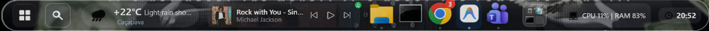

# 🚀 GigaDock

O **GigaDock** é um dock moderno, nativo e leve para Windows 10/11 que traz produtividade, fluidez e organização para sua área de trabalho. Criado para quem deseja uma interface limpa sem perder a performance.

## ✨ Funcionalidades

- **Múltiplos Ambientes:** Separe seus apps em espaços de *Trabalho*, *Estudos* e *Pessoal*.
- **Widgets Integrados:** Monitor de CPU/RAM, Relógio Pomodoro, Calendário e mais!
- **Loja de Widgets Dinâmica:** Adicione e remova funcionalidades direto da barra.
- **Atalho de Launchpad:** Pesquisa rápida (estilo Spotlight/Mac) direto do seu teclado.
- **Visual Moderno:** Construído com WPF e design Fluent (Vidro Líquido, Transparências, Animações).
- **Sem Telemetria:** Aplicativo 100% offline, rodando localmente sem enviar seus dados.

## 📥 Como Baixar e Instalar

Você pode configurar do seu jeito! Baixe a última versão na aba de [Releases](https://github.com/Contagiovaneines/WinDock-/releases) do GitHub.

1. Baixe o arquivo DockWindows-Setup.exe.
2. Execute o instalador (ele vai extrair os arquivos e criar o atalho).
3. Abra o GigaDock e personalize seus ícones, coleções e widgets!

## 🛠 Como Compilar do Zero

Se você é desenvolvedor e quer rodar o código-fonte na sua máquina:

1. Clone o repositório:
   ``bash
   git clone https://github.com/Contagiovaneines/WinDock-.git
   ``
2. Abra a solução no Visual Studio 2022.
3. Certifique-se de ter o SDK do .NET 10 instalado.
4. Defina o DockWindows.App como projeto de inicialização e compile!

*(Alternativamente, você pode usar o script 	ools/build-installer.ps1 no PowerShell para compilar e gerar o EXE single-file com todas as dependências embutidas).*

## 🤝 Open Source & Contribuição

Este projeto é **100% Open Source**. Sinta-se à vontade para clonar, fuçar no código, adicionar novos widgets ou alterar do jeito que quiser! 

Se você fizer algo legal, abra um [Pull Request](CONTRIBUTING.md) para enviar de volta pra cá!

## ☕ Apoie o Desenvolvedor

Criado e mantido por **Giovane Ines**.
Se o GigaDock ajudou a melhorar o visual do seu Windows e sua produtividade, mande um salve ou pague um café pro Dev!

- **LinkedIn:** [Giovane Ines](https://www.linkedin.com/in/giovaneines/)
- **GitHub:** [Contagiovaneines](https://github.com/Contagiovaneines)
- **Email:** giovaneinesdev@gmail.com
- **PIX:** giovaneinesdev@gmail.com

---

Feito com 🤍 e muito C# / WPF. Licenciado sob [MIT License](LICENSE).

