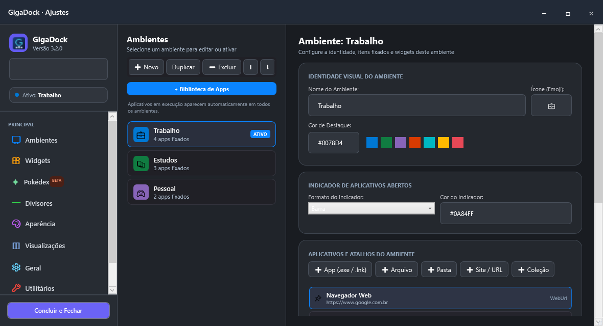
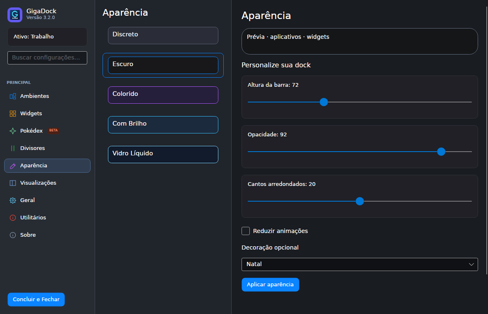

# GigaDock

Dock gratuita com **código aberto sob licença MIT**, para **Windows 10/11 x64** e **Linux x64 em beta**. Desenvolvida em C# e .NET 10, usa WPF no Windows e Avalonia no Linux, compartilhando modelos e serviços.

Organize aplicativos e widgets em ambientes como Trabalho, Estudos e Pessoal. Configurações e notas ficam no computador, sem conta obrigatória, backend próprio ou telemetria.

> Versão **3.2.0 beta**. O Linux foi executado em Ubuntu via WSLg; outras distribuições e desktops completos ainda precisam de validação. Não há garantia de funcionar em qualquer Linux nem paridade integral com Windows.

## Interface

**Windows — ambientes e ajustes**



**Linux beta — aparência**



[Veja o guia de primeiros passos](vercel/assets/screenshots/guia.png).

## Recursos

- Ambientes com aplicativos fixados, coleções, widgets e aparência próprios.
- Temas, cores, transparência, dimensões e decorações opcionais. Tema **Areia**, claro e facetado, em Ajustes → Aparência no Windows e Linux.
- Relógio, calendário, Pomodoro, notas, tarefas e indicadores do sistema. A loja explica como usar e bloqueia recursos incompletos: [disponibilidade e auditoria dos widgets](docs/WIDGETS.md).
- Central de notificações Windows com aparência da dock, em validação: a leitura requer identidade assinada e consentimento. A compilação de desenvolvimento ainda não ativa esse acesso. [Configuração e limites](docs/CENTRAL-NOTIFICACOES.md).
- Clima, câmbio e atividade pública do GitHub, conforme a integração disponível.
- Pokédex e mascotes opcionais com recursos locais; caminhada pela dock em todos os temas no Windows e Linux. [Validação e limites Linux](docs/POKEMON-LINUX.md).
- Configurações locais e convivência com a barra/painel do sistema.

| Plataforma | Integrações e limitações |
| --- | --- |
| Windows 10/11 x64 | Janelas Win32, miniaturas DWM, mídia, mixer por aplicativo e Wi-Fi/Bluetooth; WhatsApp e Discord voz bloqueados na loja enquanto incompletos |
| Linux x64 beta | Aplicativos `.desktop` via GIO; mídia com `playerctl`, áudio com `pactl`, janelas X11 com `wmctrl`; sensores, Flatpak, workspaces Sway/Hyprland e script local manual |

Linux exige X11 ou XWayland e bibliotecas nativas compatíveis. Wayland nativo e ARM64 não estão habilitados. [Limites e testes Linux](docs/LINUX-VALIDACAO.md) · [Widgets Linux](docs/WIDGETS-LINUX.md).

## Loja de widgets

No Windows, abra a **Loja de widgets** pelos Ajustes. No Linux, entre em **Ajustes → Widgets**. Os 26 tipos do catálogo explicam o que fazem, como usar e quais requisitos precisam ser atendidos antes da instalação.

| Estado | Instalação |
| --- | --- |
| Disponível | Permitida para o mínimo descrito na loja |
| Beta funcional | Permitida, com limites e integração experimental informados |
| Beta · em desenvolvimento | Bloqueada enquanto o recurso principal estiver incompleto |
| Indisponível nesta plataforma | Bloqueada na plataforma sem suporte |
| Requisito ausente | Bloqueada no Linux até disponibilizar a ferramenta ou sessão necessária |

WhatsApp e Discord voz estão bloqueados no instalador Windows atual. No Linux, lembretes automáticos de água e widgets ainda sem integração aparecem em desenvolvimento. O Teams no Windows oferece **estado estimado**, sem confirmar presença oficial; o GitHub no Linux consulta **perfil público**, sem gráfico de contribuições.

No Linux, mídia exige `playerctl`, áudio exige `pactl`, Flatpak exige `flatpak`, e áreas de trabalho exigem Sway/Hyprland com sua ferramenta. O aplicativo verifica esses requisitos locais e não instala dependências automaticamente. Após resolver um requisito, reabra os Ajustes.

Instalações antigas podem ser desativadas ou desinstaladas pela interface correspondente, preservando os dados locais. Prévias da loja são ilustrativas. Consulte a [auditoria de cada widget e suas instruções](docs/WIDGETS.md).

### Validação dos widgets

Na auditoria de **10 de outubro de 2026**, passaram **209 testes**: 74 Windows, 81 Linux e 54 compartilhados. A solução compilou em Release sem erros ou avisos. As interfaces reais WPF e Avalonia foram conferidas em processos isolados, incluindo instruções e bloqueios de instalação.

Parte das integrações foi testada com respostas e serviços controlados. Isso não certifica funcionamento com todos os aplicativos pessoais, sensores físicos ou provedores online. A validação gráfica Linux ocorreu em Ubuntu via WSLg. [Resultados e limites completos](docs/WIDGETS.md#evidências-executadas-e-limites).

## Instalação

Consulte as [releases publicadas](https://github.com/Contagiovaneines/WinDock-/releases) para verificar quais downloads estão disponíveis. Os arquivos em `release/` são gerados localmente e não fazem parte do código-fonte. O pacote Linux ainda não foi publicado online nesta entrega.

### Windows

O instalador gerado é `release/GigaDock-Setup.exe`. Requer Windows 10/11 x64 e **.NET Desktop Runtime 10 x64**. Instala por usuário e preserva configurações durante atualizações.

Builds locais não possuem assinatura confiável e podem ser bloqueados pelo Windows. Consulte [assinatura digital](docs/ASSINATURA-DIGITAL.md); não é necessário desativar a proteção do sistema para contribuir com o código.

### Linux x64 beta

Com o pacote `.tar.gz` e o checksum na mesma pasta:

```bash
sha256sum -c GigaDock-3.2.0-linux-x64.tar.gz.sha256
tar -xzf GigaDock-3.2.0-linux-x64.tar.gz
bash GigaDock-linux-x64/install-linux.sh
"$HOME/.local/bin/gigadock"
```

Requer Bash, Python 3 e as bibliotecas nativas descritas no [guia Linux](docs/INSTALACAO-LINUX.md). O runtime .NET está incluído. Instala sem sudo em `~/.local/opt/gigadock`, com atalho no menu. Início automático vem desativado; não há atualização automática pela internet.

Para atualizar, feche o app, extraia o novo pacote em outra pasta vazia e execute seu instalador. Para remover preservando os dados:

```bash
bash "$HOME/.local/opt/gigadock/uninstall-linux.sh"
```

## Compilar e testar

Use o SDK definido em [global.json](global.json). A solução completa contém WPF e deve ser compilada no Windows.

### Windows

```powershell
dotnet restore DockWindows.slnx
dotnet build DockWindows.slnx -c Release --no-restore
dotnet test tests/GigaDock.Tests.Core/GigaDock.Tests.Core.csproj -c Release
dotnet run --project src/DockWindows.App/DockWindows.App.csproj
# Gerar instalador local:
.\build_release.ps1
```

A suíte Windows também está no GitHub Actions. Testes locais podem depender da política de execução e do Smart App Control; não representam homologação de todos os computadores.

### Linux

```bash
dotnet build src/GigaDock.App.Linux/GigaDock.App.Linux.csproj -c Release
dotnet test tests/GigaDock.Tests.Core/GigaDock.Tests.Core.csproj -c Release
dotnet test tests/GigaDock.Tests.Linux/GigaDock.Tests.Linux.csproj -c Release
python3 tests/test_linux_package.py -v
dotnet run --project src/GigaDock.App.Linux/GigaDock.App.Linux.csproj
# Gerar pacote local:
bash tools/build-linux.sh
```

Os testes Python de empacotamento exigem Linux. Os workflows compilam e testam sem publicar uma release automaticamente.

## Organização do repositório

| Pasta | Conteúdo público |
| --- | --- |
| `src/` | Aplicativos Windows/Linux, instalador, modelos e serviços |
| `tests/` | Testes Windows, compartilhados, Linux e empacotamento |
| `tools/` | Scripts de build, instalação, manutenção e auditoria |
| `prototypes/` | Código do diagnóstico/protótipo Linux usado pela solução |
| `assets/` | Ícones do projeto |
| `vercel/` | Site estático e capturas selecionadas |
| `docs/` | Guias atuais, arquitetura, status e índice da documentação |
| `docs/referencia/assets/` | Manifestos de origem e integridade dos sprites |
| `.github/workflows/` | Compilação e testes automatizados |

`docs/local/`, `bin/`, `obj/`, `dist/`, `release/`, resultados de testes e credenciais ficam fora do Git. Relatórios antigos e capturas de trabalho foram preservados em `docs/local/` para consulta no computador.

[Índice da documentação](docs/README.md) · [Arquitetura](docs/ARQUITETURA.md) · [Status](docs/STATUS.md) · [Preparar envio ao GitHub](docs/PUBLICACAO-GITHUB.md).

Para gerar uma cópia pública sem arquivos ignorados nem histórico Git: `python tools/export-public-source.py`. O ZIP fica em `dist/GigaDock-codigo-fonte.zip`. O histórico original contém dados pessoais antigos; revise-o antes de publicar o repositório existente.

## Privacidade

No Windows, dados ficam em `%LOCALAPPDATA%\DockWindows`; no Linux, nas pastas XDG do usuário, sob `gigadock`. Alguns widgets consultam provedores externos quando habilitados/utilizados. Calendários e scripts locais são escolhidos pelo usuário. A integração OBS Windows utiliza o Gerenciador de Credenciais; no Linux, a senha permanece apenas na memória.

Não envie configurações, notas, senhas, certificados privados, logs pessoais ou capturas com dados reais em issues e pull requests. A [auditoria de publicação](docs/PUBLICACAO-GITHUB.md) ajuda a revisar o conteúdo antes do envio.

## Contribuir e licenças

Leia [CONTRIBUTING.md](CONTRIBUTING.md) e [CODE_OF_CONDUCT.md](CODE_OF_CONDUCT.md). Correções, documentação e testes em desktops Linux reais são bem-vindos.

O **código** é distribuído sob a [licença MIT](LICENSE). Recursos de terceiros possuem licenças e direitos próprios; a MIT do código não os relicencia. Sprites Pokémon incluem recursos com condições de uso não comercial e atribuição. Consulte [licenças e atribuições](docs/LICENCAS-TERCEIROS.md) antes de redistribuir.
